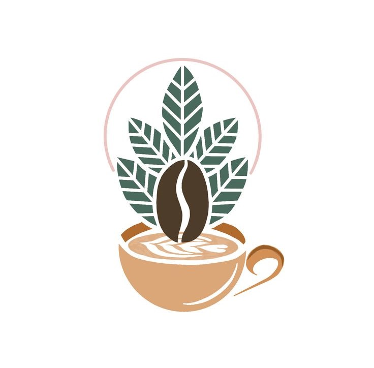
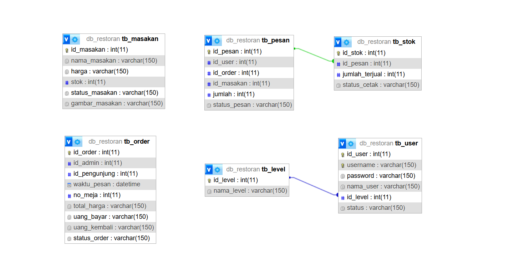

<h1 align="center">WELCOME TO MY PROJECT!</h1>
<h1 align="center">CAFE SELF SERVICE</h1>
<p align="center">
  <br>
</p>

## Project By Kelompok 4
Abdan Shobirin : (https://github.com/AbdanShobirin) <br>
Rizki Aprillia : (https://github.com/kikiapr)<br>
Mizzu Fauzil : (https://github.com/adhim0000000001)<br>
Imam Permana : (https://github.com/mamzcc)<br>
Ardellia Salsabilla : (https://github.com/ardeliasalsabila)<br>

## Tentang Project
Reporsiotory ini dibuat untuk membahas aplikasi self service pada semua cafe berdasarkan jurnal "APLIKASI SELF SERVICE MENU MENGGUNAKAN METODE
SCRUM BERBASIS ANDROID (CASE STUDY : WARKOBAR CAFÉ CIKARANG)" oleh Chrismanto Eka Prastio dan Nur Ani

## Mengapa menggunakan metode agile scrum pada penelitian?
Metode Agile adalah sebuah metodologi dalam pengembangan software yang didasarkan pada proses pengerjaan berulang yang terdiri dari aturan dan solusi yang sudah disepakati. Sedangkan Scrum merupakan metodologi yang termasuk dalam agile software development. <br> <br>
Scrum dinilai dapat menghasilkan kualitas perangkat lunak yang baik sesuai dengan keinginan pengguna, dapat digunakan dalam proyek besar maupun kecil, dan mudah untuk mengadopsi perubahan. Tahapan aktifitas scrum meliputi produk backlog, sprint backlog, daily scrum, sprint review, dan sprint restropective. Peran dalam scrum meliputi product owner, scrum master, dan development team. Scrum memiliki tahapan yang terstruktur dan bersifat perulangan, sehingga jika produk pada sprint pertama belum cukup memenuhi kebutuhan, maka pada sprint berikutnya dapat dikembangkan sistem yang sesuai dengan evaluasi pengguna.

## Diagram Alir data
<p align="center">
  
</p>

## Activity Diagram Proses Pesanan
<p align="center">
  
</p>

## Activity Diagram Membuat Pesanan
<p align="center">
  
</p>

## Relasi Table
<p align="center">
  
</p>

## Run Locally

Clone the project

```bash
  git clone https://github.com/AbdanShobirin/Projeck_Cafe-RPL_Kel4
```

Go to the project directory

```bash
  cd my-project
```

Install dependencies

```bash
  npm install
```

Start the server

```bash
  npm run dev
```


## Demo

http://localhost/restoran/index.php
